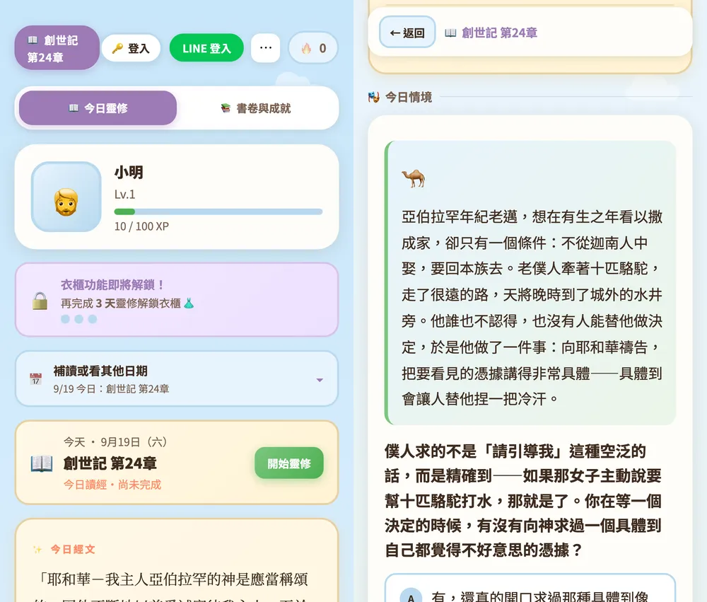

# 靈修冒險（Bible Devotional Game）

> 陪伴小組成員完成每天讀經與生命反思的靈修輔助遊戲。用輕量 RPG 的收藏與成長感陪你走，真正的核心是每日內容、牧養語氣與長期讀經節奏。

- **玩家正式站**：<https://st00777.github.io/Bible-game/bible-game-v2.html>
- 對象：大光教會成人查經班，跟著教會 2026 年讀經進度（元旦起讀新約，8/29 起接創世記）
- 定位：不取代靈修，而是輔助靈修。建議先讀完當天經文再來玩



---

## 玩家會經歷什麼

1. 用 Google 或 LINE 登入，或直接以訪客模式開始
2. 建立暱稱與角色外觀
3. 從教會讀經日曆進入今天的章節，錯過的日子可以補讀
4. 選填「今天帶著什麼心情來」，可以跳過，系統不累積情緒歷史
5. 讀導讀、章節大綱、一節金句，附完整經文連結
6. 回答一題四選一的生命情境題。**沒有標準答案**，第一次點是預覽、第二次才確認，每個選項都會得到一段接納的回應
7. 選填一段個人默想，由 AI 產生簡短回應
8. 完成後取得經驗值、經文裝備與書卷進度；有寫默想多一件裝備
9. 長期累積化身衣櫃、成就、書卷完成紀錄與稱號

情境題的用意不是測驗記憶，而是幫人把經文帶進生活。例如使徒行傳 10 章問：當神要求彼得打破從小形成的框架，如果你是彼得會怎麼反應？四個選項分別容納謹慎、順服、帶著疑問前行，以及暫時做不到的位置。

## 我們刻意不做什麼

這些原則是整個專案最有辨識度的部分，正本在 `design-principles.md`：

- 不做隨機寶箱或變動獎賞，裝備與經驗值是旅程足跡，不是主要動機
- 不用「斷簽」懲罰玩家，畫面上的天數是累計靈修天數，中斷不歸零
- 不評量默想的品質或長度，不製造小組間的屬靈比較
- 不分析、不累積玩家的情緒歷史
- 默想是玩家的悄悄話，不做查看工具
- AI 不假裝自己是牧者或諮商師，失敗時回一句固定的安慰語，玩家看不到錯誤

## 目前規模（截至 2026-09-14）

| 項目 | 數量 |
|---|---|
| 完整章節 | 236 |
| 排程日 | 218 |
| 書卷 | 25 |
| 雙章合併日 | 18 |
| 聖經人物冊 | 24 位 |

每章不是只有一道題，而是一個完整內容包：導讀、分段大綱、閱讀焦點、金句、場景、四種立場與四段回應、默想題、兩件經文裝備。經文一律逐句對照新標點和合本（CUNP1）驗證。

## 技術架構

純 HTML／CSS／JavaScript，沒有前端建置步驟。

```
bible-game-v2.html   畫面結構與樣式
app.js               遊戲流程、登入、資料同步與 UI
core.js              零 DOM 依賴的純規則（經驗值、章節鍵、日曆、進度），Node 可測
content.js           靈修內容資料，每週更新；末尾有五張表自檢
shared/              曠野呼聲（玩家回饋）狀態機正本
functions/index.js   Cloud Functions：LINE 登入、AI 默想代理、閒置回饋自動關閉
firestore.rules      Firestore 安全規則正本
scripts/             數據分析與檢查腳本
test/                npm test（node --test）
docs/                後端、內容格式、讀經進度、Firestore schema、ADR、歷史紀錄
```

- **部署**：GitHub Pages（正式站，對應 `main`）＋ Firebase Hosting（測試與 dev 預覽）
- **後端**：Firebase Auth＋Firestore＋Cloud Functions Gen 2；訪客資料存瀏覽器 localStorage
- **AI 回應**：Gemini 2.5 Flash，經 Cloud Function 代理。玩家提交默想時先寫進 Firestore 再呼叫 AI，AI 失敗不會弄丟默想
- **追蹤**：GA4

## 本機執行

沒有建置步驟，任何靜態伺服器都能跑（直接雙擊開 HTML 會被瀏覽器擋掉 Firebase 登入，要走 http）：

```bash
git clone https://github.com/st00777/Bible-game.git
cd Bible-game
npm install
python3 -m http.server 8080
```

開 <http://localhost:8080/bible-game-v2.html>。訪客模式不需要任何金鑰就能完整走一遍主流程；Google／LINE 登入與 AI 回應連的是線上 Firebase 專案，Firebase 相關設定見 `docs/backend.md`。

## 開發流程

- `main` 是正式版，`dev` 是測試版。所有工作走「分支 → PR → dev」，驗過再用 PR 進 `main`
- 改完 HTML、app.js、content.js 或 shared 跑 `npm test`
- 內容產線：Claude Code 生成 → `npm run verify:scripture` 逐句驗經文 → dev 預覽 → 手機審稿
- 每週一更新下下週內容，玩家永遠有一週緩衝

```bash
npm test                      # 內容自檢、core 規則、HTML 結構守門
npm run verify:scripture      # 對照 CUNP1 逐句驗經文
bash deploy.sh channel dev    # 部署 dev 預覽
```

## 延伸閱讀

- `CLAUDE.md`：專案總覽與每次都會用到的規則，比這份 README 完整
- `design-principles.md`：情緒與默想類功能的設計紅線
- `content-tone-guide.md`：敏感經文的處理基調，內容工作必讀
- `docs/adr/`：重大決策紀錄（戰略對焦、內容產線、單一執行者、獎勵雙軌）
- `docs/backend.md`、`docs/firestore-schema.md`、`docs/content-format.md`、`docs/reading-schedule-2026.md`
- `LEARNING.md`：踩坑紀錄

## 問題回報

- 玩家：遊戲內「⋯」選單的**曠野呼聲**留言，管理員會在後台回覆
- 開發者與協作者：開 [GitHub Issue](https://github.com/st00777/Bible-game/issues)，標籤用法見 `docs/agents/triage-labels.md`
- 這份 README 與整個 repo 不含任何密碼、金鑰或服務帳戶檔；Secret 一律放 Secret Manager

## 團隊

- **James**（st00777）：專案發起人，靈修內容方向，小組需求收集
- 共同開發者：遊戲設計發想、測試、新功能提案
